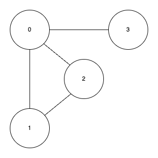

## 1.  인접리스트(adjacency list)

- 그래프의 정점과 간선의 관계를 나타내는 연결리스트를 의미한다.
<br/>
<br/>



```swift
let v: Int = 4
var adj: [[Int]] = Array(repeating: [], count: v)

adj[0].append(1)
adj[0].append(2)
adj[0].append(3)

adj[1].append(0)
adj[1].append(2)

adj[2].append(0)
adj[2].append(1)

adj[3].append(0)

// 1번방식
for i in 0..<v {
    print(i, ": ", terminator: "")
    for j in 0..<adj[i].count {
        print(adj[i][j], terminator: " ")
    }
    print()
}

// 2번방식
for i in 0..<v {
    print(i, ": ", terminator: "")
    for there in adj[i] {
        print(there, terminator: " ")
    }
    print()
}

/*
 0 : 1 2 3
 1 : 0 2
 2 : 0 1
 3 : 0
 */
```

### Swift의 Array

- Swift의 `Array`는 내부적으로 **COW(Copy-On-Write)** 최적화된 **동적 배열(Dynamic Array)**로 구현되어 있다.

### 📌 Swift `Array`의 주요 연산 및 시간 복잡도

| 연산                     | 시간 복잡도     | 설명                                          |
| ------------------------ | --------------- | --------------------------------------------- |
| `append(_:)`             | **O(1)** (평균) | 배열의 끝에 요소 추가 (용량 초과 시 **O(n)**) |
| `insert(_:at:)`          | **O(n)**        | 특정 인덱스에 요소 삽입 (이후 요소 이동 필요) |
| `remove(at:)`            | **O(n)**        | 특정 인덱스의 요소 삭제 (이후 요소 이동 필요) |
| `removeLast()`           | **O(1)**        | 마지막 요소 삭제                              |
| `removeFirst()`          | **O(n)**        | 첫 번째 요소 삭제 (이후 요소 이동 필요)       |
| `first` / `last`         | **O(1)**        | 첫 번째 또는 마지막 요소 접근                 |
| `subscript` (`array[i]`) | **O(1)**        | 인덱스로 요소 접근                            |
| `contains(_:)`           | **O(n)**        | 특정 요소 포함 여부 검사                      |
| `first(where:)`          | **O(n)**        | 특정 조건을 만족하는 첫 요소 찾기             |
| `sort()`                 | **O(n log n)**  | 배열 정렬 (퀵소트/힙소트/머지소트 기반)       |


### 예제 ) 0번부터 방문안한 노드를 찾고 해당 노드부터 방문, 연결된 노드를 이어서 방문해서 출력하는 재귀함수를 만들어라. 여기서 정점을 방문하고 다시 방문하지 않게 만들어야 한다.

```swift
let v = 10
var adjList: [[Int]] = Array(repeating: [], count: v)
var visited: [Bool] = Array(repeating: false, count: v)

func go(_ from: Int) {
    visited[from] = true
    print(from)
    
    
    
    // 1번방식: C++ 스타일
    /*
    for i in 0..<adjList[from].count {
        let there = adjList[from][i]
        if !visited[there] {
            go(there)
        }
    }
     */
    
    // 2번방식
    for there in adjList[from] {
        if !visited[there] {
            go(there)
        }
    }
}

adjList[1].append(2);
adjList[2].append(1);

adjList[1].append(3);
adjList[3].append(1);

adjList[3].append(4);
adjList[4].append(3);

for i in 0..<v {
    if !visited[i] && adjList[i].count != 0 {
        go(i)
    }
}
```

