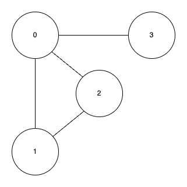

## 1.  인접행렬

- 그래프와 정점과 간선의 관계를 나타내는 bool 타입의 정사각형 행렬이다.
- 정사각형 행렬의 각 요소가 0 또는 1의 값을 가짐을 의미한다.
- 0: 두 정점 사이의 경로가 없다.
- 1: 두 정점 사이의 경로가 있다.


</img>


```swift
import Foundation

let n = 4
let arr: [[Int]] = [
    [0, 1, 1, 1],
    [1, 0, 1, 0],
    [1, 1, 0, 0],
    [1, 0, 0, 0]
]

for i in 0..<n {
    for j in 0..<n {
        if arr[i][j] != 0 {
            print("\(i)부터 \(j)까지 경로가 있습니다")
        }
    }
}
```


### 예제 1) 3번부터 5번 노드로 가는 단방향 경로가 있고 이를 인접행렬로 표현한다면?

```swift
a[3][5] = 1
```

### 예제 2) 3번노드에서 5번노드로 가는 양방향 경로가 있고 이를 인접행렬로 표현한다면?

```swift
a[3][5] = 1
a[5][3] = 1
```

### 예제 3) 정점의 개수가 20개인 그래프가 존재할 때, 이를 인접행렬로 표현하되 메모리를 최소로 사용하려면?

```swift
var a: [[Bool]] = Array(repeating: Array(repeating: false, count: 20), count: 20)
```

### 예제 4) 노드 1, 2, 3이 있으며, 1번 노드에서 2번 노드로 가는 단방향 경로와 2번 노드에서 3번 노드로 가는 단방향 경로를 인접행렬로 표현한다면?

```swift
[0, 1, 0]
[0, 0, 1]
[0, 0, 0]
```

### 예제 5) 1~4노드로 이루어진 4개의 노드가 존재한다. 1->2, 2->3, 3->4로 이동하는 노드경로가 있을 때 인접행렬로 표현한다면?

```swift
[0, 1, 0, 0]
[0, 0, 3, 0]
[0, 0, 0, 1]
[0, 0, 0, 0]
```

### 예제 6) 1번부터 5번의 노드가 존재할 때, 모든 노드가 서로 연결되어있는 완전 그래프의 인접행렬을 표현하려면?

```swift
[0, 1, 1, 1, 1]
[1, 0, 1, 1, 1]
[1, 1, 0, 1, 1]
[1, 1, 1, 0, 1]
[1, 1, 1, 1, 0]
```

### 예제 7) 노드 1, 2, 3이 있으며 1-> 3노드로 가는 단방향 경로가 있고, 3 -> 2노드로 가는 단방향 경로가 있다. 또한 2 -> 1노드로 가는 경로가 있을 때 인접행렬로 표현하려면?

```swift
[0, 0, 1]
[1, 0, 0]
[0, 1, 0]
```

### 예제 8-1) 정점은 0번 부터 9번까지 10개의 노드가 있다. 1 - 2 / 1 - 3 / 3 - 4 라는 경로가 있다. (1번과 2번, 1번과 3번, 3번과 4번은 연결되어있다.) 이를 인접행렬로 표현하라.

```swift
a[1][2] = 1; a[1][3] = 1; a[3][4] = 1;
a[2][1] = 1; a[3][1] = 1; a[4][3] = 1;
```

### 예제 8-2) 0번부터 방문안한 노드를 찾고 해당 노드부터 방문, 연결된 노드를 이어서 방문해서 출력하는 재귀함수를 만들어라. 여기서 정점을 방문하고 다시 방문하지 않게 만들어야 한다.

- Swift에서 `&&` 연산자는 **단락 평가(short-circuit evaluation)**를 수행하기 때문에  
  `visited[i]`가 `false`이면 `adjMatrix[from][i]`가 평가되지 않는다.  
  즉, 불필요한 배열 접근이 발생하지 않으므로 `continue` 방식과 성능이 동일하다.

```swift
let v: Int = 10
var adjMatrix: [[Bool]] = Array(repeating: Array(repeating: false, count: v), count: v)
var visited: [Bool] = Array(repeating: false, count: v)

// 재귀함수
func go(_ from: Int) {
    visited[from] = true
    print(from)
    
    for i in 0..<v {
        /*
        1번방식
        만약 방문하였으면 다음루프로
        if visited[i] { continue }
        
        만약 두 정점 사이의 경로가 있다면 탐색
        if adjMatrix[from][i] {
            go(i)
        }
         */
        
        // 2번방식
        if !visited[i] && adjMatrix[from][i] {
            go(i)
        }
    }
}

// 그래프 간선 추가(무방향 그래프)
adjMatrix[1][2] = true; adjMatrix[1][3] = true; adjMatrix[3][4] = true;
adjMatrix[2][1] = true; adjMatrix[3][1] = true; adjMatrix[4][3] = true;

for i in 0..<v {
    for j in 0..<v {
        // 만약 두 정점 사이의 경로가 있고 & 방문하지 않았으면 탐색하자
        if !visited[i] && adjMatrix[i][j] {
            go(i)
        }
    }
}
```


